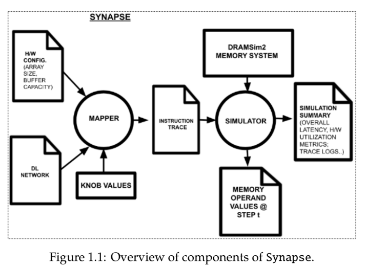

# Synapse: Systolic CNN Accelerator’s Mapper-Simulator Environment
Systolic arrays are one of the most popular compute substrates within DL accelerators today, as they provide extremely high efficiency for running dense matrix multiplications by re-using operands through **local data shifts**. One such effort by [RISE lab](https://shakti.org.in/) at IIT Madras is [ShaktiMAAN](https://github.com/iitm-sysdl/SHAKTIMAAN), an open-source DNN accelerator for **inference on edge devices** based on systolic arrays.

The complexity of this accelerator poses a variety of challenges in:
1. Hardware verification
2. Bottleneck analysis using performance modelling
3. Design space trade-offs
4. Efficient mapping strategy
5. Compiler optimizations

To tackle these challenges, I built **Synapse** (SYstolic CNN Accelerator’s MaPper-Simulator Environment): a versatile python based mapper-simulator environment. This work, done under the guidance of [Prof. Pratyush Kumar](http://www.cse.iitm.ac.in/~pratyush/), was submitted as my Bachelor's thesis at [IIT Madras](https://www.iitm.ac.in/).

## Key Contributions:
* **Mapper** that generates instruction trace given any workload, knob values for a targeted architecture.
* Functional **simulator** cost model for ShaktiMAAN.
* An **Reinforcement Learning agent** that interacts with the mapper-simulator environment to search through the design space to find optimal hardware (array, buffer size), software (network folds, loop order) co-design knobs.

## Dependencies
1. [Installing DRAMSim2](https://github.com/umd-memsys/DRAMSim2)
2. [Installing SWIG](https://www.swig.org/)
3. OpenAI Gym 0.7+
4. PyTorch 1.11+

## Using Synapse

### Mapper
1. Instructions for SHAKTIMAAN and simulator can be generated using `systolic/mapper.py`, which takes care of all dependency resolutions between different instructions. 
2. As done in the cost-model file `model.py`, instantiate `NetworkMapping` object and pass DL network (`topologies/1.csv`), systolic array (`configs/1.cfg`) configurations to generate instructions.

### Simulator
1. An event-driven, analytical, data-flow accurate `systolic/simulator.py` tries to model SHAKTIMAAN. It uses the instructions generated by the mapper and runs on an event-driven fashion using `timestamps`. 
2. It also calculates instruction-wise and global **utilization efficiency**. 
3. It finally verifies if the output it generates matches with the actual expected `MatMul` output. 
4. As done in the cost-model file `model.py`, instantiate `Simulator` object and pass systolic array, instructions generated (from mapper or otherwise with proper ISA) to simulate. It outputs layer-wise, instruction-wise, global statistics in `outputs/` directory.

### Reinforcement Learning Agent
A single Jupyter notebook `ppo_main.py.ipynb`, defines the RL agent, update rule, learning algorithm (PPO) and trains, evaluates the model to find optimal knobs like `buffer-size`, `loop-order`, etc. It can be easily ported to run on public-cloud like GCP, AWS, etc. or google-colab.

## Additional resources
1. [Bachelor's thesis](https://drive.google.com/file/d/1PMTwZhSbaysdSdLks98JykyDDe_itRQa/view?usp=sharing)
2. [Presentation slides](https://drive.google.com/file/d/1NnDDXgM6h1zbRrv5gJUAIdI9pAYBtN9T/view?usp=sharing)
